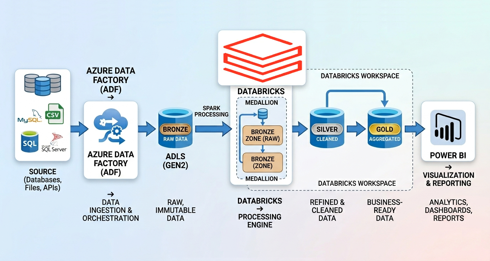

<h1 align="center">Suvankar Nag</h1>

  <b>Azure Data Engineer</b> 
  ADF • Databricks • PySpark • SQL • Python • Power BI

  
  
  
  

---

## 👨‍💻 Profile

Azure Data Engineer with 5+ years of experience building scalable and reliable data platforms on Azure.  
Specialized in designing ETL/ELT pipelines, transforming large datasets using PySpark, and delivering business insights through Power BI.

---

## ⚙️ Tech Stack

    
  
  
  
  
  
  
  
  
  
  
  

---
## 🎓 Certifications

  

  

---

## 🚀 Key Work

🔹 Built scalable **ADF pipelines** for enterprise data workflows  
🔹 Developed **PySpark transformations in Databricks**  
🔹 Implemented **Medallion Architecture (Bronze → Gold)**  
🔹 Delivered **Power BI dashboards for business insights**  
🔹 Worked in **Agile environments (Jira, Azure DevOps Boards)**  

---

## 🏗️ Architecture Overview

  

---

## 💼 Experience

  <b>Azure Data Engineer</b> 
  <b>SPAATech Solution India</b> 
  <i>Feb 2024 – Apr 2025</i>

 

  🚀 Designed and developed scalable data pipelines using <b>Azure Data Factory (ADF)</b> 
  ⚡ Built and optimized <b>PySpark</b> transformations in <b>Azure Databricks</b> 
  🏗️ Implemented <b>Medallion Architecture (Bronze → Silver → Gold)</b> 
  🗄️ Managed <b>raw (Bronze) data</b> in <b>Azure Data Lake Storage Gen2 (ADLS Gen2)</b> 
  🧱 Leveraged <b>Delta Lake</b> for <b>Silver (cleaned)</b> and <b>Gold (aggregated)</b> layers 
  🔗 Integrated multiple data sources into <b>ADLS Gen2</b> 
  📊 Delivered interactive <b>Power BI</b> dashboards for business insights 
  🤝 Worked in Agile environments using <b>Azure DevOps</b>

---

## 📊 GitHub Insights

  
  

---

## 📬 Contact

- LinkedIn: https://www.linkedin.com/in/suvankarnag2020  
- Email: suvankar.nag1993@outlook.com  

---

  <i>Designing scalable data systems that drive impact.</i>
  <i>— @suvankarnag1</i>

